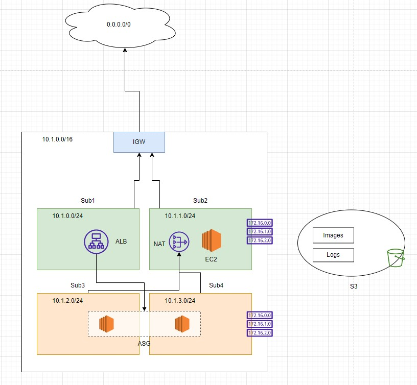
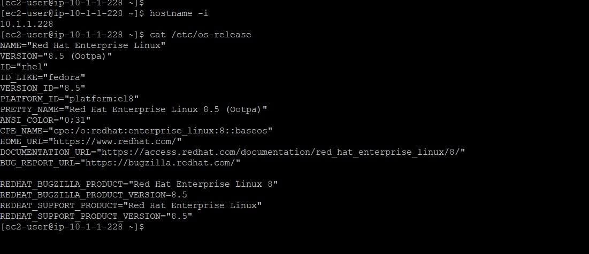

# Terraform Technical Challenge

## Modules present in the repository
* VPC- with public and private subnets
* Autoscaling Group with ALB
* EC2 Instance
* S3 with lifecycle policy

## High-level Diagram


## How to run the code
Set environment varialbles for `AWS_ACCESS_KEY_ID` and `AWS_SECRET_ACCESS_KEY` for provider autehtnication.
```
export AWS_ACCESS_KEY_ID="xxxxxxxxxxxxxxxxxxxxx"
export AWS_SECRET_ACCESS_KEY="xxxxxxxxxxxxxxxxxxxxxxxxxxxxxxxxxxxxxx" 
export AWS_REGION="us-east-2"
```

Initialize and apply terraform
```
terraform init

terraform apply auto-approve
```

Upon completion of `terrafor apply` a private SSH key `bastian-host-private.pem` will be created in the current working directory. Private SSH key will be used to authenticate to EC2 instance present in public subnet.

## Validating Public EC2 Instance authentication
SSH command will be outputted.
```
ssh -i ./bastian-host-private.pem ec2-user@<PUBLIC-IP>
```

Screenshot.




## References
Hashicorp official aws provider documents are used throughout the development of code along with AWS official docs.

https://registry.terraform.io/providers/hashicorp/aws/latest/docs

Other references are pinned with corresponding resources in the code.
